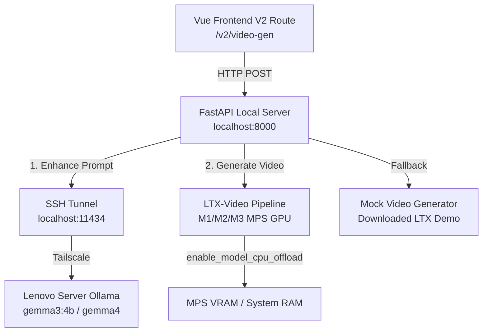

# LTX-Video Local API Bridge & Vue Frontend Integration

This repository hosts the lightweight FastAPI server (`server.py`) that bridges the frontend Vue application with a locally hosted **LTX-Video** generation pipeline, utilizing an optimized MPS (Metal) offloader for macOS and a Tailscale-networked **Ollama** prompt enhancer.

---

## System Architecture



---

## 1. Backend Server Setup (`server.py`)

The local ML API server runs on FastAPI. It manages memory and execution serialization to fit within Apple Silicon (M-series Mac) unified memory constraints.

### Prerequisites

1. **Conda Environment**:
   Initialize and activate the `local-ml-py311` conda environment:
   ```bash
   conda activate local-ml-py311
   ```

2. **HuggingFace Authenticated Cache**:
   The distilled LTX-Video model (~39 GB) is cached at `~/.cache/huggingface/hub/models--Lightricks--LTX-Video-0.9.8-13B-distilled`. To bypass anonymous rate limits during snapshot validation, supply your HuggingFace token:
   ```bash
   export HF_TOKEN="your_huggingface_token"
   ```

### Execution Features

- **MPS CPU Offloading**:
  Uses Diffusers `enable_model_cpu_offload(device="mps")` which dynamically maps pipeline components (Transformer, VAE, Text Encoder) to the Mac GPU only when active, keeping total system VRAM under **10 GB** (safely avoiding unified memory swaps).
- **GPU Serialization Queue**:
  Implements an async FIFO queue (`asyncio.Lock()`) wrapped in FastAPI's `run_in_threadpool`. This serializes model calls, guaranteeing only one generation runs at a time and preventing concurrent Out of Memory (OOM) crashes.
- **Fast Startup / Mock Toggle**:
  To support instant frontend UI/UX testing without compiled model initialization, launch with the `MOCK_VIDEO=true` toggle. In this mode, the server starts in **0.1 seconds** and returns high-quality synthetic panning shots from HuggingFace datasets after a simulated 4-second delay.

### Launching the Server

**Standard (Real ML) Mode**:
```bash
HF_TOKEN=hf_... MOCK_VIDEO=false /Users/saurabh/miniconda3/envs/local-ml-py311/bin/python -u server.py
```

**Mock Demo Mode**:
```bash
MOCK_VIDEO=true /Users/saurabh/miniconda3/envs/local-ml-py311/bin/python -u server.py
```

---

## 2. Remote Ollama Integration via Tailscale

To leverage an intelligent LLM for prompt expansion without overloading the local Mac CPU/GPU, the server routes prompt enhancement requests to a Tailscale-networked Lenovo server running Ollama.

### SSH Tunnel Mapping
Because the remote Ollama daemon listens only on localhost (`127.0.0.1:11434`) inside the Lenovo box, establish an SSH local port-forwarding tunnel on your Mac:

```bash
ssh -N -L 11434:127.0.0.1:11434 lenovo
```

This maps your local `localhost:11434` directly to the remote server.

### Robust Failover Enhancement
In `server.py`, the `/enhance` API acts as a client:
1. Queries the tunneled Ollama daemon requesting the `gemma3:4b` model.
2. If the tunnel is disrupted or Ollama times out (e.g. during a cold-start load of 60 seconds), it automatically prints a warning and falls back to a local, rule-based mock enhancer.
3. This guarantees that user interactions on the UI are never blocked.

---

## 3. Frontend Route Integration (`VideoGenV2.vue`)

The updated high-fidelity video generator interface is exposed at the `/v2/video-gen` route.

### Design Elements
- **Aesthetic Brand Identity**: Uses Katana's design system tokens (`text-ink`, `bg-surface`, and the signature soft purple buttons `bg-brand`), preventing generic layouts.
- **Dynamic Settings Pills**: Features interactive modal dialogs allowing the user to configure variables (e.g. Watermark, Subtitles, Story flow) and remove/ replenishes them instantly via active pills.
- **Backdrop Blurs**: Backdrop filters are integrated on all dialogs, giving a sleek glassmorphic focus overlay.
- **Interactive Music Selector**: Contains a stylized audio style grid to pick background music categories (e.g. Upbeat, Corporate, Synthwave).
