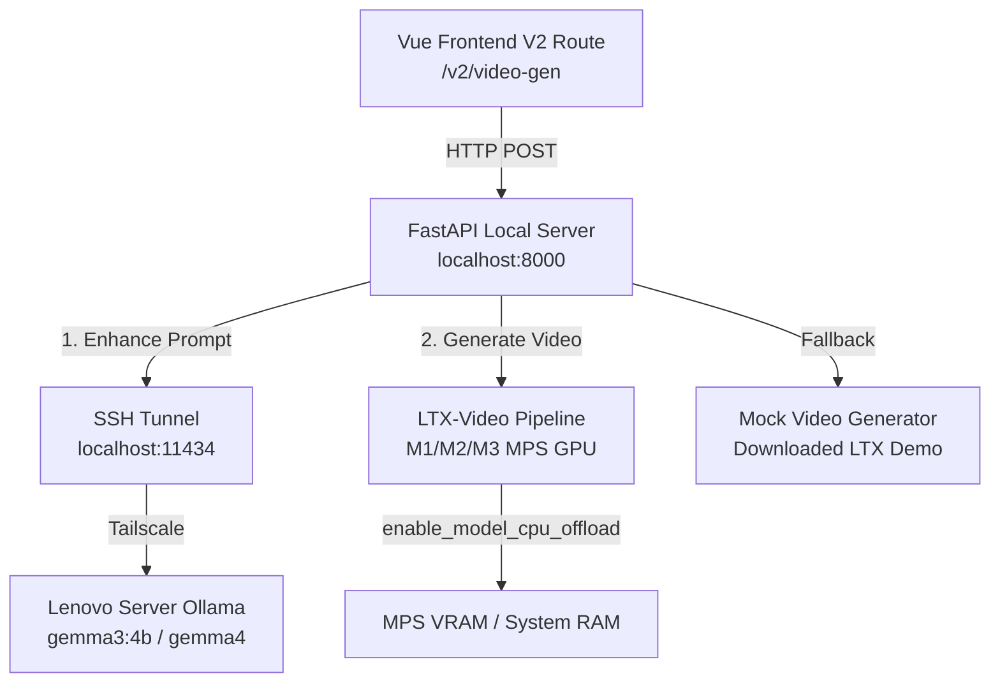

# Pluto: LTX-Video Local API Bridge

This repository hosts a lightweight FastAPI server that bridges frontend applications (like the Vue-based Katana VideoGen UI) with a locally hosted **LTX-Video** generation pipeline. It is optimized for macOS Apple Silicon (MPS backend) and integrates with a remote/local Ollama instance for prompt enhancement.

---

## Project Structure

This project follows clean organization standards and best practices:

```
pluto/
├── .env.example            # Template for environment variables
├── .gitignore              # Git ignore rules for cached, virtualenv, and video output files
├── environment.yml         # Conda environment definition file
├── requirements.txt        # Python pip dependencies
├── README.md               # Project documentation
├── agents.md               # Antigravity developer agent workflows and setup notes
│
├── src/                    # Source code directory
│   ├── server.py           # FastAPI entry point, endpoint routing, and mock handlers
│   ├── generate_video.py   # LTX-Video pipeline initialization and execution details
│   └── enhance_prompt.py   # LTX CINEMATIC prompt enhancement scripts
│
├── tests/                  # Integration and unit tests
│   └── test_server.py      # Self-executable API test suite (mock mode)
│
├── docs/                   # Documentation resources
│   ├── assets/             # PNG screenshots and visual assets
│   └── ANTIGRAVITY-HANDOFF-backend.md  # Historical task description for backend handoff
└── outputs/                # Directory for generated local MP4 videos (Git ignored)
```

---

## System Architecture



---

## 1. Setup & Installation

### Option A: Conda Environment (Recommended)
Initialize and activate the `local-ml-py311` conda environment:
```bash
conda env create -f environment.yml
conda activate local-ml-py311
```

### Option B: Python Virtualenv
```bash
python3 -m venv .venv
source .venv/bin/activate
pip install -r requirements.txt
```

### Environment Configuration
Copy the template `.env.example` to `.env` and fill in your HuggingFace token and other parameters:
```bash
cp .env.example .env
```

---

## 2. Running the API Server

Run the server using Python from the project root:

**Standard (Real ML) Mode**:
```bash
# Set MOCK_VIDEO=false to run actual model inference
MOCK_VIDEO=false python src/server.py
```

**Mock Demo Mode** (Instant startup, perfect for frontend development):
```bash
# Runs immediately (0.1s startup) using pre-packaged or online mock video samples
MOCK_VIDEO=true python src/server.py
```

---

## 3. Running Tests

Run the self-contained integration tests to verify the API endpoints (runs immediately using mock mode and does not download large model weights):
```bash
python tests/test_server.py
```

---

## 4. Key Implementation Details

*   **MPS CPU Offloading**: Uses Diffusers `enable_model_cpu_offload(device="mps")` which dynamically maps pipeline components (Transformer, VAE, Text Encoder) to the Mac GPU only when active, keeping total system VRAM under **10 GB** (safely avoiding unified memory swaps).
*   **GPU Serialization Queue**: Implements an async FIFO queue (`asyncio.Lock()`) wrapped in FastAPI's `run_in_threadpool`. This serializes model calls, guaranteeing only one generation runs at a time and preventing concurrent Out of Memory (OOM) crashes.
*   **Robust Prompt Enhancement Fallback**: The `/enhance` API queries the tunneled Ollama daemon requesting the `gemma3:4b` model. If the tunnel is disrupted or Ollama times out (e.g. during a cold-start load of 60 seconds), it automatically prints a warning and falls back to a local, rule-based mock enhancer.
