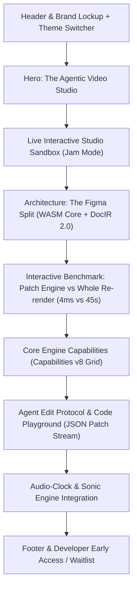

# MotionVector Studio Landing Page & Interactive Playground Plan

## 1. Product Positioning & Research Synthesis

### Inspirations & Benchmarks:
* **Blacksmith:** Ruthless focus on measured speed (2x faster, 50% cheaper), concrete performance benchmarks, interactive terminal/runner demos, and live metrics.
* **Linear:** Impeccable dark-mode typography (true-black, high-contrast zinc hierarchy, purposeful monochrome mark, micro-subtle borders, fluid keyboard shortcuts).
* **Cursor:** Live product experience inside the browser viewport, interactive agent prompt-to-diff demonstrations, and instant developer CLI integration.
* **Figma:** The architectural split—native WASM core running at 60 FPS under a fast, responsive React/DOM chrome.

### MotionVector Studio Value Proposition:
> **"Video is now a continuous patch loop, not a restart."**
> Talk to it, direct-manipulate the canvas, or let autonomous agents compile scene edits into sub-frame accurate DocIR patches in 4 milliseconds without re-rendering the entire video.

---

## 2. Page Architecture & Section Hierarchy

---

## 3. Real MotionVector Assets Inventory

* **Official Brand SVGs:**
  * Vector Mark: `/brand/system/mark.svg` & `/brand/system/mark-light.svg`
  * Full Lockup: `/brand/system/lockup.svg` & `/brand/system/lockup-light.svg`
  * Icon & Glyphs: `/brand/system/icon.svg`, `/brand/system/icon-glyph-mono.svg`
  * Social Card: `/brand/system/social-card.svg`
* **Real Production Render Comparisons:**
  * EP01 Frame Benchmarks: `ep01_compare_4.0s_motionvector.png`, `ep01_compare_12.0s_motionvector.png`, `ep01_compare_20.0s_motionvector.png`, `ep01_compare_28.0s_motionvector.png`, `ep01_compare_38.0s_motionvector.png`
  * Benchmark Bar: `motionvector-bench.png`
* **Typography & Palette (from AGENTS.md):**
  * True-black base: `#000000` / `#050506`
  * Zinc neutrals: `#09090b`, `#18181b`, `#27272a`, `#52525b`, `#a1a1aa`, `#f4f4f5`
  * Electric Vector Accent: `#10b981` (Emerald), `#06b6d4` (Cyan), `#f59e0b` (Amber)

---

## 4. Interactive Studio Playground ("Jam Mode") Features

1. **Interactive Canvas Preview:**
   * High-precision vector canvas rendering live DocIR scenes with smooth 60fps animations.
   * Pan, zoom, click-to-select layers (Text nodes, Vector paths, Shape layers).
2. **Sub-Frame Scrubbing Timeline:**
   * Interactive playhead, timecode HUD (`00:04.120`), Play/Pause toggle (`Space` shortcut), frame stepping (`←` / `→`).
   * Track lanes for Video, Motion Graphics, Audio/TTS, and Subtitles.
3. **Live Layer Inspector:**
   * Real-time sliders for Spring Physics (Stiffness, Damping, Mass), Position (`x`, `y`, `scale`), and Typography.
4. **Live Patch Diff Feed:**
   * Emits real JSON patches on every drag or slider edit in real time (`{"op": "replace", "path": "/scenes/0/layers/1/transform", ...}`).
5. **Interactive Patch vs Re-render Comparison Slider:**
   * Before/After split view proving instant 4ms patch execution vs 45s traditional frame re-encoding.

---

## 5. Execution Steps

1. **Build `studio.html` & `index.html`:** Full standalone, dependency-free interactive HTML5 application featuring the complete design system, three-state theme switcher (Dark/Light/System), and live Canvas sandbox.
2. **Deploy to Vercel/Local Preview:** Verify in browser using Chrome DevTools MCP.
3. **Connect Waitlist Form:** Hook up the live waitlist endpoint to continue capturing developer requests.
